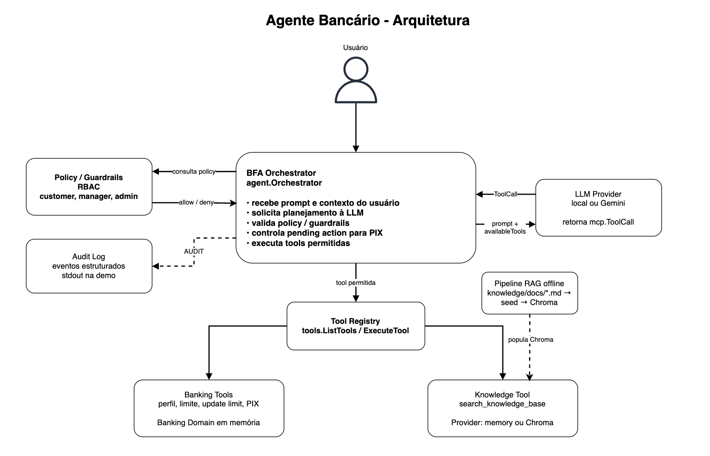

# Agente Bancário

Projeto de um BFA para atendimento bancário. O agente responde a perguntas, consulta uma base de conhecimento (RAG) e executa operações bancárias simples usando tools controladas pelo backend.

## Execução do Projeto

Comecei separando o problema em dois fluxos principais: consultas informativas e operações bancárias. A partir disso, modelei primeiro o backend de execução das tools, sem LLM, para garantir o funcionamento independente e desacoplado de autorização e regras de negócio.

A primeira etapa foi construir a camada de contrato e execução das tools: `ToolDefinition`, `ToolCall`, `tools.ExecuteTool` e `agent.Orchestrator`. Essa base permitiu validar o comportamento do backend antes de integrar uma LLM real. Com isso, a LLM passou a ser uma fonte de planejamento de ações, e não o componente responsável por autorização ou execução.

Depois, evoluí o projeto para receber uma `ToolCall`, simulando o que uma LLM retornaria. Essa decisão ajudou a manter a LLM fora da camada de segurança: ela pode planejar uma ação, mas quem decide se a ação pode acontecer é o backend.

Em seguida, implementei as tools bancárias, a camada de policy/RBAC e o fluxo de PIX com pending action. Para operações críticas, como PIX, optei por exigir confirmação explícita controlada pelo backend, removendo qualquer `confirmed` que pudesse vir da LLM.

A implementação foi pensada de forma agnóstica em relação a provedores externos. A arquitetura separa o planejamento da LLM, a execução das tools e a busca na knowledge base, permitindo plugar outros providers sem alterar o fluxo principal do agente. O provider local e a knowledge base em memória permitem executar a demo sem dependências externas. O provider Gemini demonstra a integração com uma LLM real, e o provider Chroma demonstra o fluxo de RAG com documentos versionados, seed e busca vetorial local.

## Arquitetura



## Como rodar

### Demo rápida sem dependências externas

Este modo usa o planner local (llm/planner.go) e a base de conhecimento em memória (knowledge/memory.go).

```bash
go run .
```

Exemplos de prompts:

```text
quero consultar meu perfil
qual é o limite do meu cartão?
quero aumentar meu limite para 12000
fazer pix de 2000 para joão
confirmo
qual é a taxa do empréstimo consignado?
```

### Rodando com Chroma

Suba o Chroma e o seed da base de conhecimento:

```bash
docker compose -f infra/chroma/docker-compose.yml up --build
```

Em outro terminal, rode a aplicação usando o provider Chroma:

```bash
KNOWLEDGE_PROVIDER=chroma go run .
```

### Rodando com Gemini

Rode:
```bash
LLM_PROVIDER=gemini GEMINI_API_KEY="sua-chave" go run .
```

Com Gemini e Chroma:

```bash
LLM_PROVIDER=gemini KNOWLEDGE_PROVIDER=chroma GEMINI_API_KEY="sua-chave" go run .
```

## Decisões de arquitetura e trade-offs

### LLM planeja, backend decide

A LLM não executa operações diretamente. Ela apenas sugere uma `ToolCall` com nome e argumentos. O backend recebe essa chamada, valida a policy, executa a tool permitida e controla confirmações críticas.

Trade-off: isso adiciona uma camada de orquestração, mas evita confiar autorização e confirmação diretamente à LLM.

### Policy separada das tools

As tools representam capacidades, como `get_customer_profile`, `update_card_limit` e `create_pix`. A autorização fica em `policy`, separada da implementação da tool.

Trade-off: exige mais código do que validar dentro da própria tool, mas deixa as regras de segurança mais explícitas e reutilizáveis.

### PIX com pending action

Operações PIX são tratadas como críticas. A LLM pode propor `create_pix`, mas o backend remove qualquer `confirmed` vindo da LLM e cria uma ação pendente. A execução só acontece quando o usuário confirma explicitamente.

As pending actions ficam em memória e são protegidas por mutex para evitar race conditions em acessos concorrentes dentro do mesmo processo.

Trade-off: o fluxo tem dois passos, mas evita que a LLM infira confirmação ou execute movimentação financeira sem consentimento explícito.

### Providers plugáveis

O projeto possui providers configuráveis por variável de ambiente:

```text
LLM_PROVIDER=local | gemini
KNOWLEDGE_PROVIDER=memory | chroma
```

Trade-off: aumenta um pouco a superfície de configuração, mas permite rodar o desafio sem API externa e também testar com uma LLM real.

### Auditoria mínima

A auditoria foi posicionada no `agent.Orchestrator` porque ele é o ponto central do fluxo: recebe a `ToolCall`, decide se cria uma pending action, chama a execução da tool e observa sucesso ou falha. Isso evita espalhar logs dentro de cada tool e permite auditar o ciclo de vida da ação de forma uniforme.

O orquestrador registra eventos estruturados em stdout com o prefixo `AUDIT`, incluindo usuário, role, ação, tool, status e motivo da falha.

Trade-off: para a demo, o stdout deixa a auditoria simples e visível. Em produção, esses eventos deveriam ser enviados para um storage e serem persistidos.

### RAG com Chroma e fallback em memória

O provider `memory` deixa a demo simples e reprodutível. O provider `chroma` demonstra uma busca vetorial local usando documentos versionados em `knowledge/docs`.

Trade-off: o embedding usado no Chroma é simples e local, baseado em palavras-chave. Isso facilita a execução local, mas não tem a qualidade de um modelo real de embeddings.

## Estrutura do projeto

```text
agent/
  Orquestrador do fluxo de tools e pending actions.

banking/
  Domínio bancário fake em memória: clientes, limites, saldos e PIX.

infra/chroma/
  Docker Compose, Dockerfile e seed para subir/popular o Chroma.

knowledge/
  Camada de RAG. Possui provider em memória, provider Chroma e documentos-fonte.

llm/
  Planejamento de tool calls. Suporta provider local e Gemini.

mcp/
  Contratos internos de tool calling usados pelo agente.

policy/
  Regras de autorização e RBAC.

tools/
  Definições e execução das tools disponíveis para a LLM.
```

## Organização em camadas

A pasta `mcp` concentra os contratos internos de tool calling. Ela não depende do domínio bancário, da LLM, do CLI ou do provider de RAG. Isso mantém `ToolDefinition`, `ToolParameter` e `ToolCall` como modelos reutilizáveis.

A pasta `tools` faz a ponte entre esse contrato genérico e as capacidades reais da aplicação. Ela expõe as definições que a LLM pode enxergar e também adapta os argumentos recebidos para chamadas de domínio.

O `agent` orquestra o ciclo de vida da execução: recebe a tool call planejada, controla pending actions, executa tools e registra auditoria. A autorização fica em `policy`, enquanto as regras e dados bancários ficam em `banking`.

A camada `knowledge` isola a busca de conhecimento. O fluxo principal não precisa saber se a resposta veio de memória ou do Chroma, apenas chama `SearchKnowledgeBase`.

## Tools implementadas

```text
get_customer_profile
  Consulta o perfil do cliente com controle de acesso.

get_card_limit
  Consulta o limite do cartão.

update_card_limit
  Atualiza o limite, respeitando o máximo permitido e o valor já utilizado.

create_pix
  Cria PIX somente após confirmação explícita do usuário.

search_knowledge_base
  Consulta a base de conhecimento usando memory ou Chroma.
```

## Limitações e próximos passos

- A autenticação é simulada com um usuário fixo no `main.go`. Em um cenário real, o BFA receberia o contexto de um usuário autenticado por token/JWT, API Gateway ou middleware, propagando esse contexto para policy, tools e auditoria.

- Os dados bancários estão em memória. Em produção, perfis, limites, saldos e transações viriam de sistemas internos ou bancos transacionais.

- As pending actions ainda são locais ao processo. Em produção, seriam persistidas com TTL, idempotência e controle transacional.

- A auditoria é registrada em stdout para a demo, mas não deveria ficar restrita ao CLI. Em produção, os eventos deveriam ser persistidos em banco, fila, arquivo estruturado ou audit log, com retenção e busca posterior.

- Os documentos da knowledge base estão versionados no repositório para facilitar a avaliação do desafio. Em produção, eles deveriam vir de uma fonte externa controlada, como CMS, bucket ou base documental.

- O embedding do Chroma é por palavras-chave, e não um modelo semântico real. O próximo passo seria substituir o embedding local por um provider real de embeddings.

- A resposta do CLI foi mantida simples para a demo. Uma evolução seria melhorar a formatação das respostas para todos os tipos retornados pelas tools.

- O fluxo é CLI. Uma API HTTP para conversas e confirmações seria um próximo passo natural.

- A pasta `mcp` modela o contrato interno de tool calling, mas não expõe um servidor MCP formal. Hoje as tools rodam no mesmo processo Go, em produção, esse registry poderia ser exposto por um servidor separado.

- A cobertura de testes ainda deve ser ampliada para policy, tools, pending actions e fluxos críticos de autorização.
